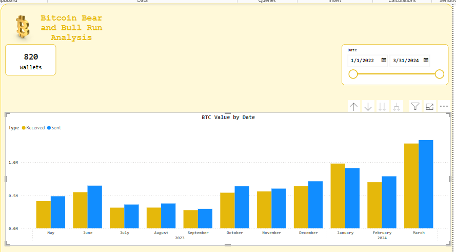
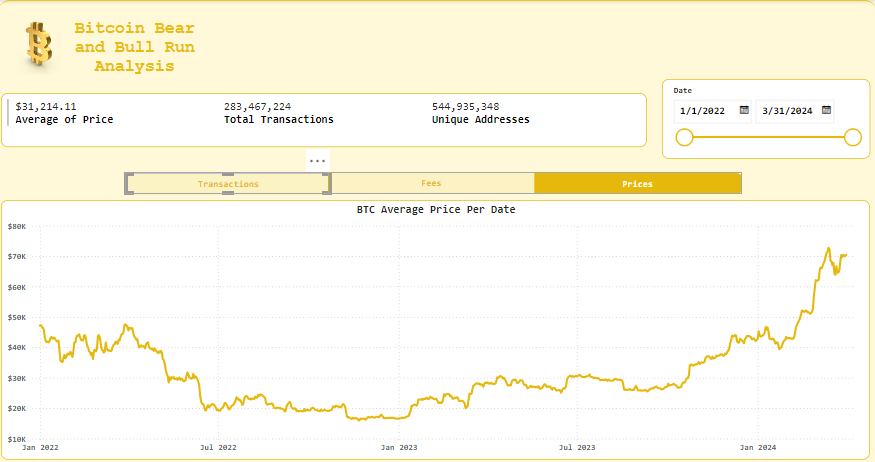
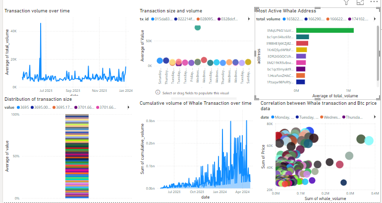
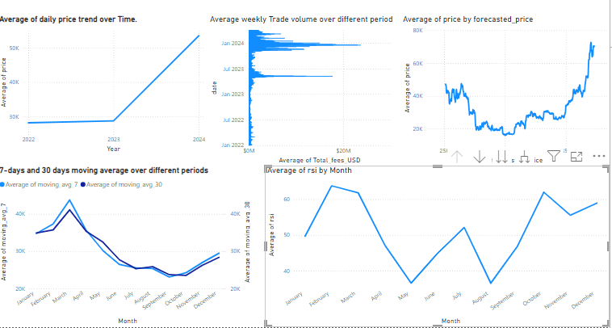
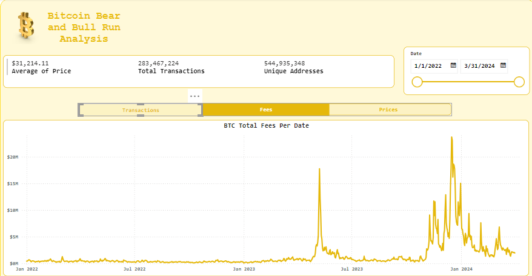
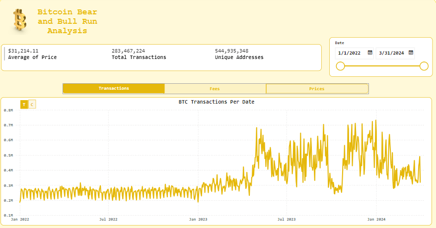

# BITCOIN ANALYSIS

## Table Of Contents
[Project Overview](#project-overview)

[Data Sources](#data-sources)

[Tools](#tools)

[Data Cleaning/Preparation](#data-cleaning)

[Exploratory Data Analysis](#exploratory-data-analysis)

[Data Analysis](#data-analysis)

[History Point](#history-point)

[Results/Findings](#results)

[Recommendations](#recommendations)

[Limitations](#limitations)

[Reference](#reference)

### Project Overview
This data analysis project aims to provide insights into the bitcoin open and close price data and the whale transaction from 1st January 2022 to 3rd March 2024. By comparing the bear and bull run and the trend analyses, we seek to identify the  Relative strength index (RSI), key active whale addresses, and total address volume. We gain a deeper understanding of the leading cause of bitcoin rise and fall. 

 
 

### Data Sources
**Price Data**: The dataset used for this analysis is the **'Price_data.csv'** file containing detailed information about each daily price, transaction count, and total USD made by unique addresses.

**Whale transaction**: The dataset used in this analysis is the **'Whale_transaction.csv'** file containing information about active whale addresses and their key players, transaction ID, and value. 
### Tools
- Python, Bash Script, Jq: Data scrapping 
- MYSQL - Data cleaning and Analysis
- PowerBI - Creating visualization
- Github - Documentation

### Data Cleaning
  In the initial data preparation phase, we performed the following tasks:
  
    1. Data loading and inspection
    
    2. Align date format
    
    3. Check for outliers
    
    4. Replace -1 with Sent and 1 with received in the whale_transactions
    
    5. Change datatype from float to string
    
    6. Data cleaning and formatting
### Exploratory Data Analysis
EDA Involved exploring the price_data and whale_transaction to answer key questions, such as:
- What are the most active whale addresses by total volume?
- What is the total volume of whale transactions over a while?
- What are the distribution of whale transaction sizes?
- What is the relationship between whale transaction size and the total volume
- Show the cumulative volume of whale transactions over time
- Show the relationship between whale transaction volumes and BTC price data.
- What are the seasonal patterns in BTC prices, weekly and monthly?
- How does BTC price change over time?
- What are the moving price averages that smooth out price data and identify trends over different periods?
- What is the volume of BTC traded over different periods
- How to use time series forecasting techniques to predict future BTC prices.
- How to use RSI to identify overbought or oversold conditions

### Data Analysis
```sql
SELECT * 
FROM Price_data

--1) Align Date Format
ALTER TABLE Price_data
Alter column Date DATE

Select *
From Price_data

Select *
From INFORMATION_SCHEMA.COLUMNS
Where TABLE_NAME = 'Price_data'

--2) For Table Whale_Transactions
ALTER TABLE Whale_transactions
Alter column Date DATE

Select *
From INFORMATION_SCHEMA.COLUMNS
Where TABLE_NAME = 'Whale_transactions'

--3) Replace -1 with Sent and 1 with received in the Whale_transactions
--FIrstly we have to change the datatype of Type from Float to String
ALTER TABLE Whale_transactions
Alter column Type NVARCHAR(10)

UPDATE [dbo].[Whale_transactions]
SET Type = REPLACE(Type,'-1','Sent')

UPDATE [dbo].[Whale_transactions]
SET Type = REPLACE(Type,'1','Received')
```

```sql
  SELECT 
    time AS date, 
    value AS total_volume
FROM whale
WHERE value >= 1000
GROUP BY time, value
ORDER BY time;

 SELECT 
    value
FROM whale
WHERE value >= 1000;

SELECT 
    Time  AS date, 
    Value, 
    tx_id
FROM whale
WHERE Value >= 1000;
select * from whale;

SELECT 
    address, 
    SUM(value) AS total_volume
FROM whale
WHERE value >= 1000
GROUP BY address
ORDER BY total_volume DESC
LIMIT 10;

SELECT 
    DATE(time) AS date, 
    SUM(value) OVER (ORDER BY DATE(time)) AS cumulative_volume
FROM whale
WHERE value >= 1000;

SELECT 
    DATE(time) AS date, 
    SUM(value) AS whale_volume,
    Price 
FROM whale
JOIN bitcoin_price_data ON DATE(time) = Date
WHERE value >= 1000
GROUP BY time, price;

Use crypto_data;
select * from bitcoin_price_data;
-- Monthly Seasonality
SELECT 
    EXTRACT(MONTH FROM date) AS month,
    AVG(price)
FROM bitcoin_price_data
GROUP BY EXTRACT(MONTH FROM date)
ORDER BY month;

-- Weekly Seasonality 
SELECT 
    EXTRACT(day FROM date) AS day_of_week,
    AVG(price) AS avg_price
FROM bitcoin_price_data
GROUP BY EXTRACT(Day FROM date)
ORDER BY day_of_week;

SELECT 
    date,
    price
FROM bitcoin_price_data
ORDER BY date;

-- 7-day Moving Average
SELECT 
    date,
    price,
    AVG(price) OVER (ORDER BY date ROWS BETWEEN 6 PRECEDING AND CURRENT ROW) AS moving_avg_7
FROM bitcoin_price_data;

-- 30-day Moving Average
SELECT 
    date,
    price,
    AVG(price) OVER (ORDER BY date ROWS BETWEEN 29 PRECEDING AND CURRENT ROW) AS moving_avg_30
FROM bitcoin_price_data;

-- Weekly Trading Volume
SELECT 
    DATE AS week,
    SUM(Total_fees_USD) AS weekly_volume
FROM bitcoin_price_data
GROUP BY date
ORDER BY week;

-- Price Forecasting
WITH linear_regression AS (
    SELECT 
        date,
        price,
        ROW_NUMBER() OVER (ORDER BY date) AS t
    FROM bitcoin_price_data
),
regression_model AS (
    SELECT 
        AVG(t * price) AS xy,
        AVG(t) * AVG(price) AS x_avg_y_avg,
        AVG(t * t) AS x_squared,
        AVG(t) * AVG(t) AS x_avg_squared,
        (AVG(t * price) - AVG(t) * AVG(price)) / (AVG(t * t) - AVG(t) * AVG(t)) AS slope,
        AVG(price) - (AVG(t * price) - AVG(t) * AVG(price)) / (AVG(t * t) - AVG(t) * AVG(t)) * AVG(t) AS intercept
    FROM linear_regression
)
SELECT 
    date,
    price,
    intercept + slope * ROW_NUMBER() OVER (ORDER BY date) AS forecasted_price
FROM bitcoin_price_data, regression_model;

-- Relative Strength Index (RSI)
WITH price_changes AS (
    SELECT 
        date,
        price - LAG(price) OVER (ORDER BY date) AS price_change
    FROM bitcoin_price_data
),
gains_losses AS (
    SELECT 
        date,
        CASE 
            WHEN price_change > 0 THEN price_change 
            ELSE 0 
        END AS gain,
        CASE 
            WHEN price_change < 0 THEN -price_change 
            ELSE 0 
        END AS loss
    FROM price_changes
),
avg_gains_losses AS (
    SELECT 
        date,
        AVG(gain) OVER (ORDER BY date ROWS BETWEEN 13 PRECEDING AND CURRENT ROW) AS avg_gain,
        AVG(loss) OVER (ORDER BY date ROWS BETWEEN 13 PRECEDING AND CURRENT ROW) AS avg_loss
    FROM gains_losses
)
SELECT 
    date,
    100 - (100 / (1 + avg_gain / avg_loss)) AS rsi
FROM avg_gains_losses;
```

### History Point
After the world stood still in 2020, Bitcoin was not spared, it went downhill to $6.9k, only to skyrocket from $34.7k to $60k in 2021 outdoing its previous year by $12.7k. 
Then came the bear's grip in 2022 and just like gravity it went down, starting at $41.1k and ended quietly at $16.9k.
In 2023, Bitcoin took a twist and climbed up starting at $20.2k and ended the year on a high note at $42.5k, due to this it had its highest amount of transaction at 731 in December 31, 2023.

The bull's horn:- This beautiful ride that started in 2023 continued to the mountain top in 2024, the year price started at $42.8k and continues to climb up to $70.4k in March 2024. The Bitcoin halving that happens every 4 years is supposed to happen this year it was anticipated to take place on April 20, 2024. During this event, the block reward for mining Bitcoin will be reduced from 6.25 BTC to 3.125 BTC and we are all waiting for it to happen.

How much Bitcoin do you think will drop out of the market, we are waiting to find out and do you think the market will go bearish or bullish?

### Results
The analysis results are summarized as follows:






#### Answers 
- I guess there are not alot of people that can buy 100k worth of Bitcoin but the big whalers can.
- The RSI showed that if its over 70, it was over bought, which indicates that the particular asset has been experiencing strong upward momentum, likewise if its below 30, it was over sold whcih indicates that the asset experienced a strong downward momenetum but in this case they maintained a balance as shown in the dasboard
- I think Bitcoin price changes more on certain days of the week and over time, in 30 days it evens out and covers up for the days it messed up if you hold it for longer.
- In the long term, Bitcoin is in an uptrend if you are willing to be patient and ignore how volatile the market can get.
- Due to the halving that occured, as history have always happened, by the end of the year, 2024, the market will still be an uptrend. This have a potential of being the longest uptrend to have ever happened. 

### Recommendations
In conclusion, Bitcoin's journey has been a rollercoaster ride full of highs and lows. 2024 has been a good high ride especially because we are all looking forward to the quaterly halving that happens every 4 years where half of the bitcoin gets burned out of the market, This halving is a significant event in the Bitcoin ecosystem as it reduces the rate at which new bitcoins are created, which historically has had a bullish impact on the price of Bitcoin​, i will advise you keep holding your Btc so you dont miss out on the massive bull run that will take place when the halving happens.

### Limitations

- Our data was from January, 2022 to March, 2024, so it is limited and not up to date, at the time we scraped the data, bitcoin halving had not happened but it has happened now and the market is very bullish.

### Reference

- [Kaggle](https://www.kaggle.com/)
- [CoinEx Explorer](https://explorer.coinex.com/)


